# Color Name Charts

> Note: This is an attempt at taking the XML data and transforming it back
> into the chart form as shown in [NBS Special Publication 440 "Color: Universal Language and Dictionary of Names"](https://archive.org/details/coloruniversalla00kell/).
> The script that generates these is somewhat unsophisticated as it relates
> to word-wrapping and recomposing rectangles into polygons, but was
> sufficient to perform visual validation to match the source data.

## How to use the color-name charts

- Given: Munsell renotation of sample.
- Required: The color designation.
- First: Turn to the particular name chart containing the Munsell hue of the renotation (sec upper right-hand corner of name chart), or if the hue falls on two successive charts, use both of them.
- Second: Find the point on the chart defined by the Munsell value and Munsell chroma of the renotation; or, if two charts are used, plot the point on both of them.
- Third: Read the color designation of the block within which the point falls. If it falls on a hue, value, or chroma boundary between blocks, read color designations of all blocks touching the point.

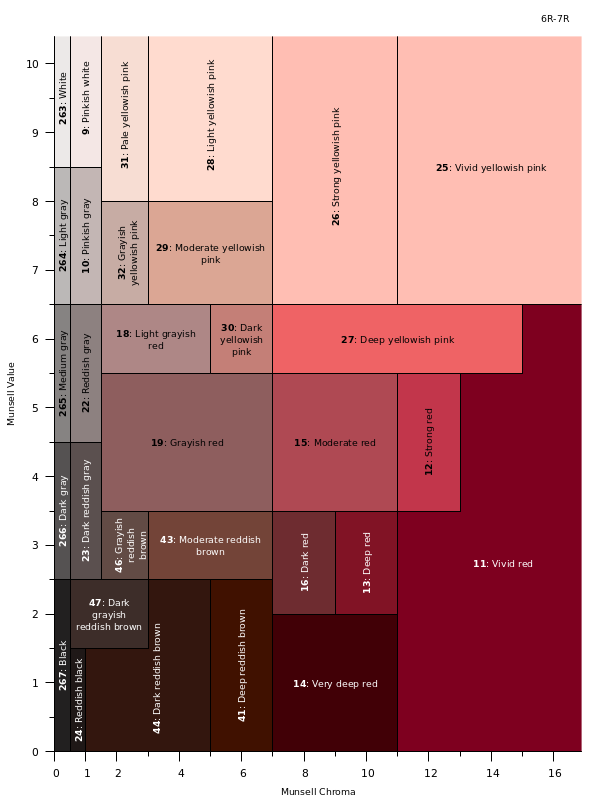

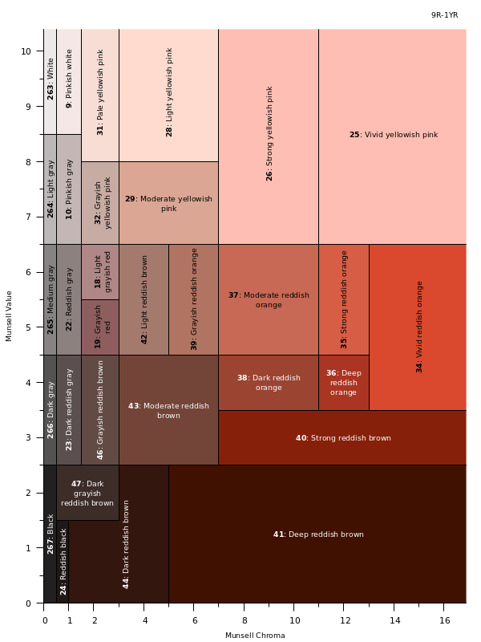

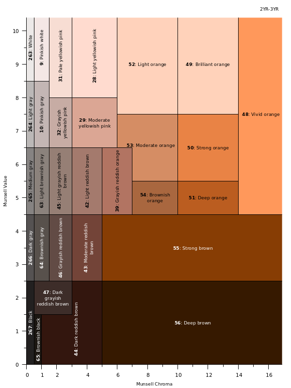
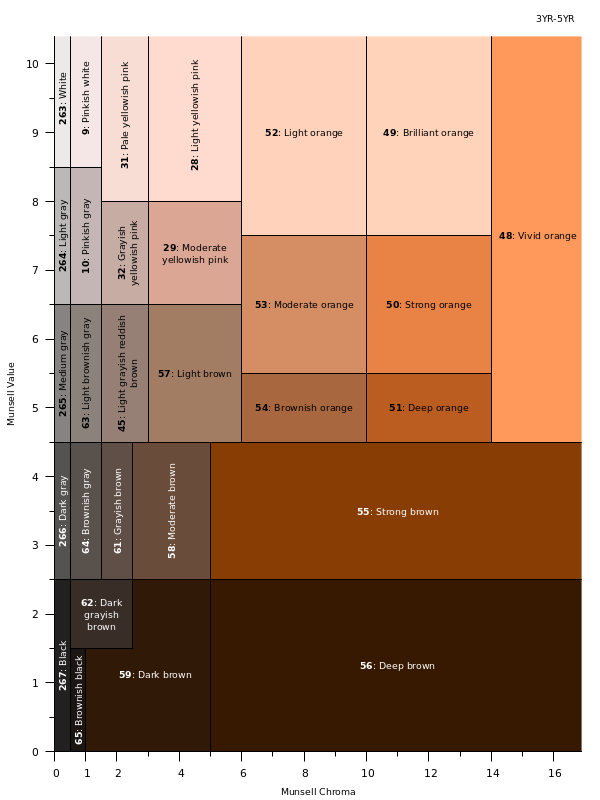

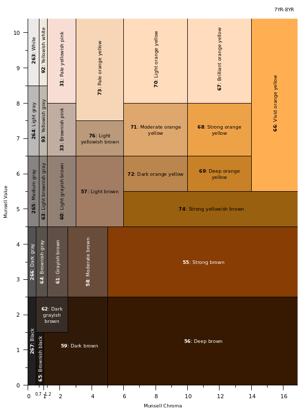
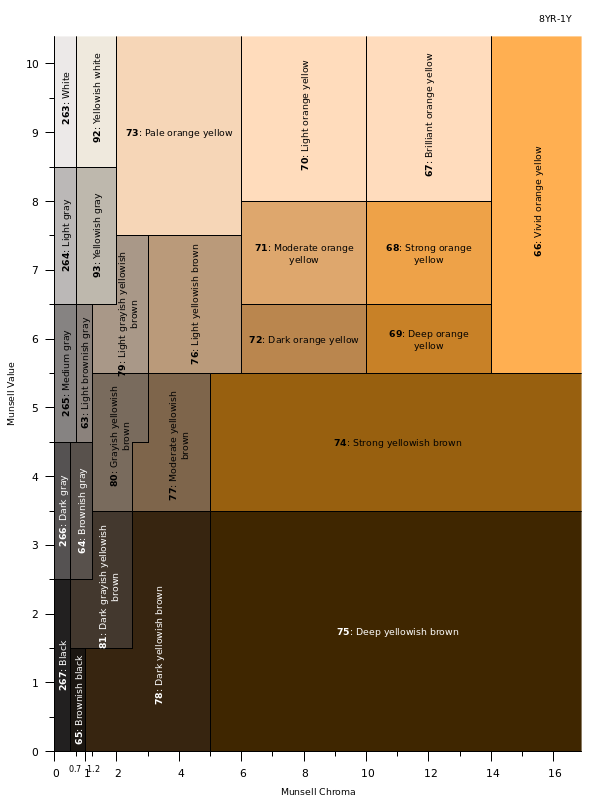
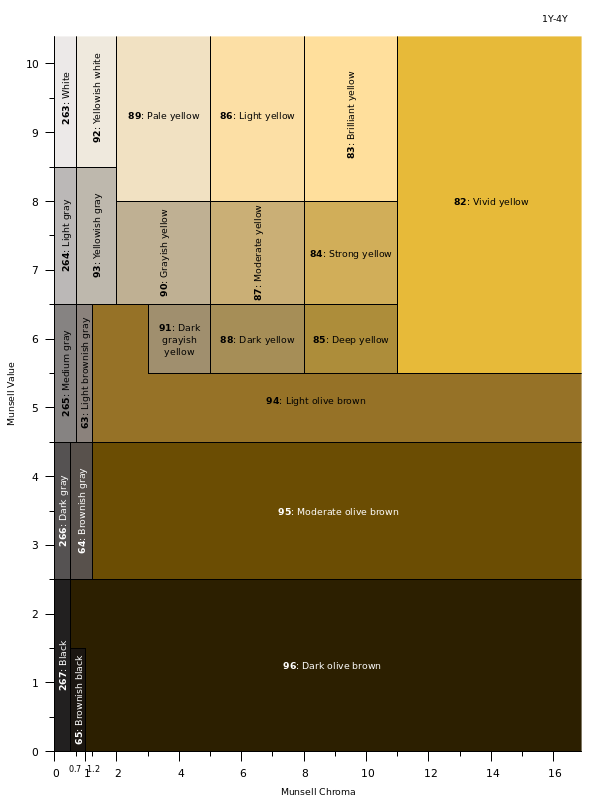
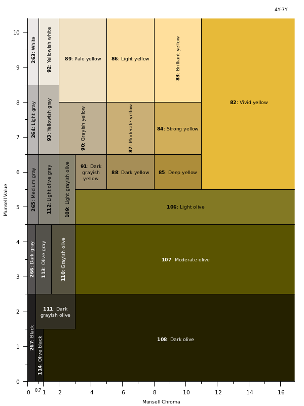

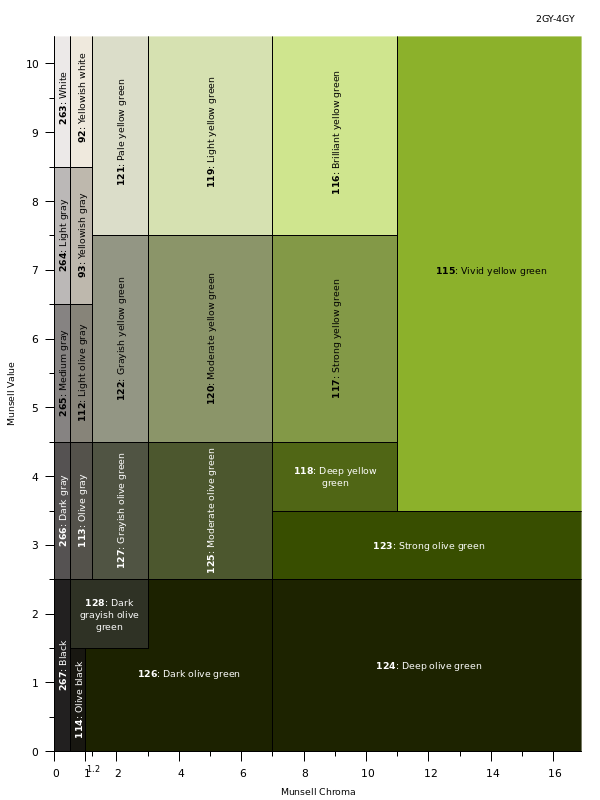

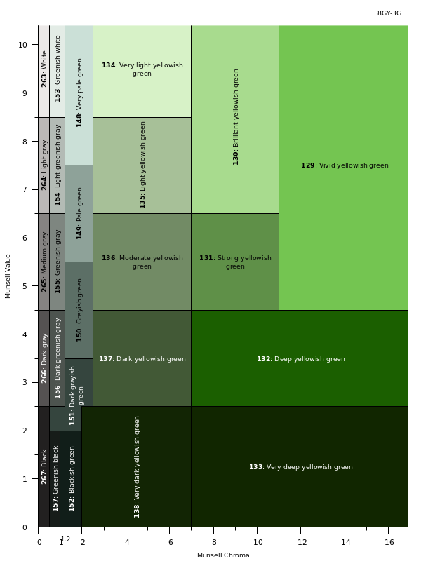

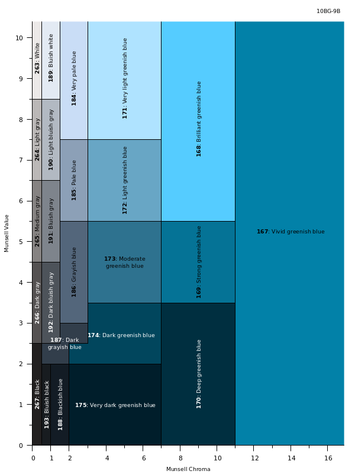

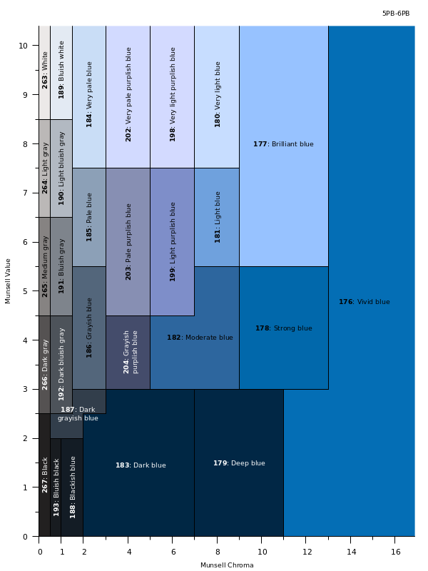
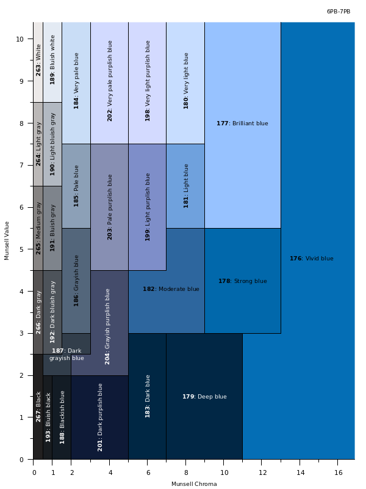

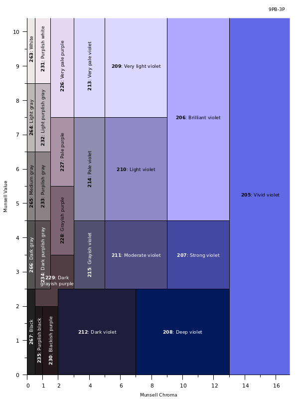
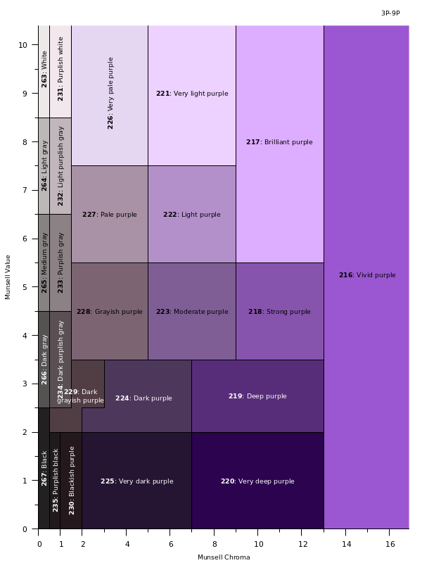

